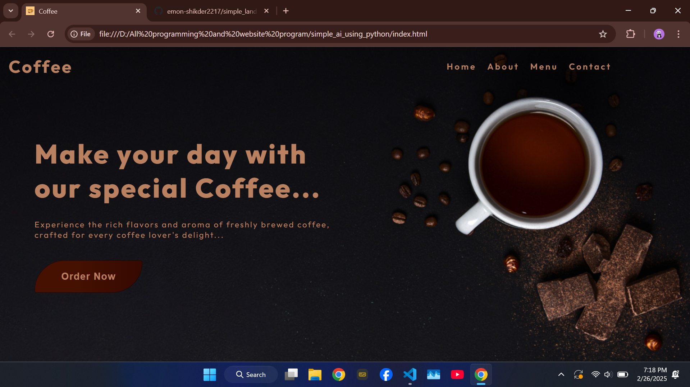

# ☕ Coffee Bliss Website

Welcome to the **Coffee Bliss** website repository! This project is a beautifully crafted, simple website built using HTML and CSS, designed to showcase the charm and aroma of coffee. Whether you're a coffee enthusiast or a web developer, this project is a delightful blend of design and functionality.

## 📸 Screenshots

Here’s a glimpse of the Coffee Bliss website:

  
*Enjoy the rich, inviting design of our coffee-themed website!*

## 🚀 About the Project

**Coffee Bliss** is a responsive, visually appealing website that celebrates the world of coffee. It features a clean layout, a stunning background image, and elegant typography to create an immersive experience for visitors. This project is perfect for learning basic web development...

### ✨ Features
- **Simple Codebase**: Easy-to-read HTML and CSS, ideal for beginners and experienced developers alike.
- **Clone the Repository**:
  ```bash
  git clone https://github.com/emon-shikder2217/simple_landing_page.git
  ```

## 🌐 Live Demo
You can check out the live version of this project here:
  
  ```bash
  https://cooffee00.netlify.app/
  ```


